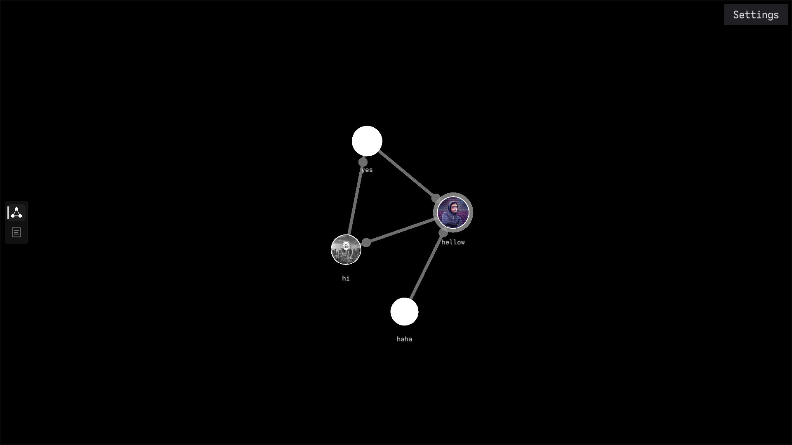
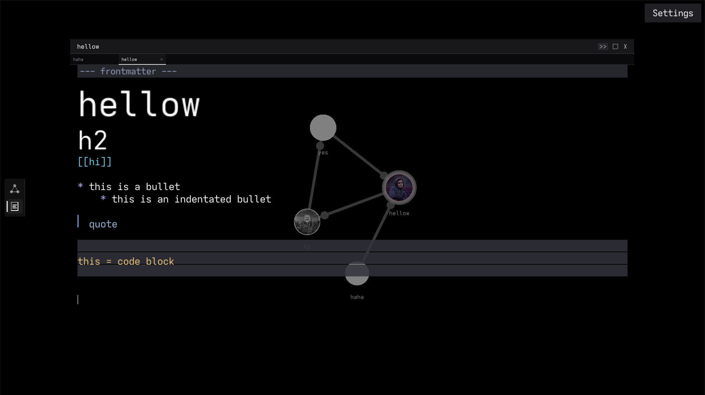
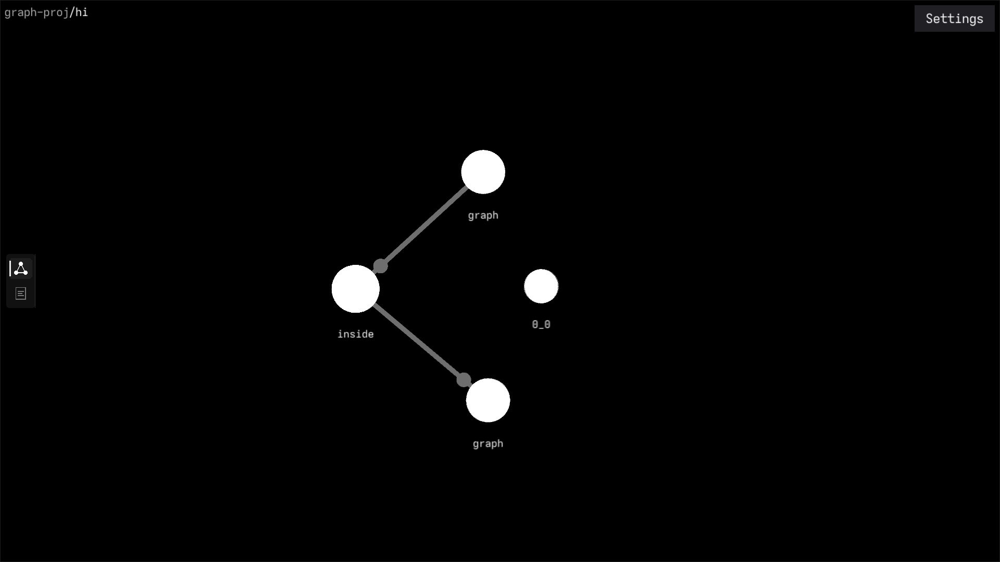

# Rust Graph — a local-first knowledge graph

A Logseq/Obsidian-style knowledge graph built in Rust on raylib. Your "graph"
is just a folder of plain Markdown files — nodes are notes, `[[wikilinks]]` are
edges, and a folder sitting next to a note is that node's recursive sub-graph.
No database, no proprietary vault format, no lock-in: stop the app and your
notes are still exactly what they were before you started.

## Screenshots

<!-- Drop your captures into screenshots/ and reference them here. Suggested
     shots: a force-laid-out graph (1440x810+ fullscreen looks best), the
     markdown editor with tabs, and one of the smaller test_graphs to show
     sub-graph structure. -->







## Features

### Graph view
- **Force-directed layout inspired by d3-force**, seeded with a phyllotaxis
  (sunflower) spiral so a fresh graph never starts as a tangled blob.
- **Alpha cooling** instead of a fixed-strength simulation: forces are scaled
  by a temperature that decays each tick, so the graph *provably settles* to a
  stable layout (~23s) and then pauses — then reheats the moment you touch a
  node, resize the window, or retune a force.
- **Spatial-hash grid repulsion**, so the all-pairs repulsion term runs on the
  visible neighbourhood instead of O(n²).
- **Recursive sub-graphs**: middle-click a node that owns a folder to drill
  into it, and use the breadcrumb trail to climb back out. Sub-graph folders
  are created straight from the node's context menu.
- **Graphical notes**: a `header:` frontmatter field hangs an image on a node,
  so notes can literally be photos, diagrams or thumbnails on the graph.
- **Live force tuning**: press `F` for the debug panel — sliders for spring
  k, damping, centre pull, repulsion radius/k/core, rest gap and alpha decay,
  an alpha-cooling switch, and a *Respawn* button that re-lays the graph out.
  Values persist to the OS config dir and restore on next launch.

### Editor view
- Full **Markdown editor** with syntax-aware rendering: headings, bold/italic,
  code and fences, blockquotes, horizontal rules and images.
- **Tabs** for multiple notes, each with its own cursor, selection and scroll
  position; single click resumes exactly where you left off.
- **Autocomplete** for `[[wikilinks]]` as you type, a **command palette**
  ("Add asset"), and image import via a native file picker (`rfd`).
- **Autosave** on a typing pause, plus `Ctrl+S` to force-save immediately.
- Custom system fonts, text zoom (`Ctrl + =` / `Ctrl + -`), and a settings
  dialog that persists everything it changes.

### Editing the graph itself
- Single-click a node to select and drag it; double-click opens the note in
  the editor.
- `N` creates a new note, right-click opens a context menu (rename, delete,
  create/open sub-graph), `Del` asks for confirmation, and renaming a node
  rewrites every `[[link]]` that points at it.

## The notes format

Nothing special is required — plain Markdown in a flat folder:

```md
# my-note

Regular prose with a [[link]] to another note in the same folder.
```

- **Node name** = file name (`my-note.md` → `my-note`).
- **Edges** = `[[wikilinks]]`, treated as bidirectional in the graph.
- **Recursive graph** = a folder named exactly like a note (`my-note/`) —
  that node opens into its own graph.
- **Node image** = `header:` in frontmatter:

```md
---
header: [[assets/pic.png]]
---

# my-note
```

Run it against any folder with Markdown files — `test_graphs/` holds a few
hand-rolled layouts of different densities for trying the app out:

| Folder        | Notes | Links | What it exercises          |
|---------------|-------|-------|----------------------------|
| `tree`        | 31    | 30    | minimal sparse structure   |
| `chain`       | 21    | 20    | linear layouts             |
| `hubs`        | 33    | 120   | disconnected cluster blobs |
| `sparse-web`  | 60    | 153   | airy medium graph          |
| `big_graph`   | 244   | 577   | dense, stress-test lump    |

## Controls

| Action                        | Input                                  |
|-------------------------------|----------------------------------------|
| Pan the graph                 | middle-mouse drag                      |
| Zoom                          | mouse wheel                            |
| Select / drag a node          | left click                             |
| Open a note in the editor     | double-click                           |
| Drill into a sub-graph        | middle-click a folder node             |
| Back to parent graph          | `Alt` + left-click, or click a breadcrumb |
| New note                      | `N`                                    |
| Delete node                   | `Del`, then confirm with `Y`           |
| Node context menu             | right-click                            |
| Force-tuning panel            | `F` (closes with `Esc`)                |
| Text zoom                     | `Ctrl + =` / `Ctrl + -`                |
| Save                          | `Ctrl+S`                               |
| Switch graph / editor view    | far-left icon dock                     |

## Building and running

Rust (2024 edition) and a C toolchain for raylib/GLFW are all you need.

```sh
cargo build --release
cargo run --release path/to/your/notes-folder
```

Settings (window size, text zoom, font, force values) persist to the OS config
directory (`~/.config/rust-graph` on Linux).

## Project layout

```
src/
  main.rs                entry point, main loop, view-switcher glue
  config.rs              global scalars, zoom, colours, layout constants
  app_config.rs          persistent OS-level settings file
  filesystem.rs          file scanning, Markdown link parsing, CRUD
  frontmatter.rs         frontmatter (header:) parsing and updates
  sidebar.rs             graph/editor view-switcher dock
  graph.rs               module wiring for the graph sub-modules
  graph/
    processing.rs        nodes/edges, forces, alpha cooling, layout, persistence
    renderer.rs          graph + force panel drawing
    input_handler.rs     graph interaction, context menus, navigation
    settings.rs          settings dialog / font picker
  editor/
    buffer.rs            document model, undo-friendly edits
    input_handler.rs     editing commands and shortcuts
    renderer.rs          Markdown renderer
    tabs.rs              multi-document tabs + per-document state
    autocomplete.rs      [[link]] completion
    command.rs           command palette
    images.rs            async image decode + texture upload
    text.rs              font management, glyph measurement
```

## Testing

```sh
cargo test
```

140 tests cover the interesting-isolated parts — grid-vs-brute-force repulsion,
the alpha-cooling rest guarantee, edge/radius updates on note edits, link
renaming, and the shared hit-test geometry of the force panel.
